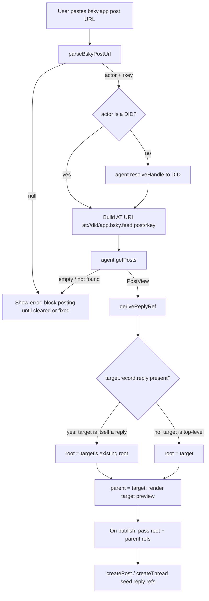

# feat: Reply to existing Bluesky posts

## Summary

Add an optional "Reply to" field to the Bluesky compose tab: paste a `bsky.app`
post URL, and the post (or whole thread) you compose publishes as a reply that
continues that post's thread. Works for any public post. Closes issue #15.

---

## Problem Frame

The plugin can compose a standalone post or a brand-new thread, but every thread
it creates starts a fresh root — there is no way to attach to a post that already
exists on Bluesky. Issue #15 ("Support adding posts to previous posts") asks for
exactly that: continue an already-published post's thread from Obsidian.

The reply primitives already exist internally. `createThread` in `src/bluesky.ts`
already builds `reply: { root, parent }` strongrefs to chain its own posts; it
just always seeds the root from the first post it creates. The missing pieces are
(1) turning a user-supplied `bsky.app` URL into the AT-protocol refs of an
existing post, (2) deriving the correct *thread root* for that post, and (3) a UI
surface to enter and confirm the target.

---

## Requirements

### Reply targeting and resolution

- R1. The user can enter a `bsky.app` post URL in the compose tab to designate a post to reply to.
- R2. The plugin resolves the URL — whether the profile segment is a handle or a DID — to the target post's AT-URI and CID, and derives the correct thread root.
- R3. Resolution works for any public post; the target need not be authored by the logged-in account.

### Composing and posting

- R4. A composed single post publishes as a reply to the target. A composed multi-post thread attaches in order, each post chained off the previous, all sharing the target's thread root.
- R5. The local archive copy (when enabled) records replies the same way it records other posts.

### UX and validation

- R6. Before publishing, the UI shows a preview of the target post (author plus a text snippet) so the user can confirm the target.
- R7. An invalid or unresolvable URL surfaces a clear error and blocks publishing until the field is corrected or cleared; an empty field posts normally with no reply.
- R8. Reply state clears after a successful post and on view reset.

### Testing and docs

- R9. The pure resolution logic (URL parse, root derivation, target resolution against an injected agent) is covered by unit tests; non-network field behavior is covered by e2e tests.
- R10. The README documents replying to a post.

---

## Key Technical Decisions

- **Thread-root derivation.** When replying, `parent` is the target post's
  strongref and `root` is the target's *existing* thread root if the target is
  itself a reply, otherwise the target itself: `root = target.record.reply?.root ?? {uri,cid}(target)`.
  Bluesky threads reference the root, not just the immediate parent; using the
  parent as the root breaks threading when replying to a nested post.
- **obsidian-free, agent-injected resolution module.** All resolution logic lives
  in a new `src/utils/reply.ts` that imports only `@atproto/api` types (erased at
  runtime) and takes the agent as a parameter. `BlueskyBot` (which imports
  `obsidian`) calls into it. This keeps the `obsidian` runtime out of the module
  so it is unit-testable in plain Node with a mock agent.
- **Unified thread-seeding.** Rather than branch `createThread`, seed its existing
  `root`/`parent` loop variables from the optional reply refs. With no reply the
  first composed post becomes the root (today's behavior); with a reply the loop
  is seeded with the external root and target so the first post replies to the
  target and the root stays external throughout. One code path.
- **Unauthenticated resolve with login fallback.** Resolution tries
  `resolveHandle`/`getPosts` unauthenticated and logs in on failure, mirroring the
  existing `fetchBlueskyProfileMetadata` pattern. Public posts resolve without
  credentials.
- **New mocha + tsx unit lane.** A second test lane (`test:unit`) covers the
  network-touching resolution logic the provider-free e2e suite is forbidden to
  exercise. `mocha` and `tsx` are already dev dependencies.
- **Block on unresolved URL.** A non-empty URL field that fails to resolve blocks
  posting instead of silently posting a standalone post — replying to the wrong
  thing (or nothing) is a worse failure than a blocked button.

---

## High-Level Technical Design

Resolve-and-reply data flow, from pasted URL to seeded reply refs:

Per-post chaining inside a thread reply: post 0 gets `{ root, parent: target }`;
each later post gets `{ root, parent: previously-posted }`. The root is constant
(the external thread's root) for every post.

---

## Implementation Units

### U1. Add a mocha + tsx unit-test lane

- **Goal:** Enable fast, network-free unit tests for `src/` logic without touching the e2e suite.
- **Requirements:** R9
- **Dependencies:** none
- **Files:** `package.json` (add `test:unit` script), `.mocharc.json` (new), `test/unit/` (new dir), `test/README.md` (note the new lane)
- **Approach:** Configure mocha to run `test/unit/**/*.test.ts` through the `tsx` loader (e.g. `mocha --import tsx`). Keep it fully separate from the wdio config and the `test:e2e` script. Unit tests import modules under test by relative path (`../../src/utils/reply`) rather than the `@/` alias, so the lane needs no tsconfig-path resolver. Modules under unit test must not import `obsidian` (enforced by design in U2/U3).
- **Patterns to follow:** existing `test/README.md` layout table and the provider-free philosophy it documents.
- **Test scenarios:** Test expectation: none — scaffolding. Verified by U2's tests running green under `npm run test:unit`.
- **Verification:** `npm run test:unit` discovers and runs a `.test.ts` file under `test/unit/` and `npm run test:e2e` is unaffected.

### U2. URL parsing and reply-ref derivation (pure)

- **Goal:** Provide the two pure functions the feature is built on, fully unit-tested.
- **Requirements:** R1, R2
- **Dependencies:** U1
- **Files:** `src/utils/reply.ts` (new), `test/unit/reply.test.ts` (new)
- **Approach:** `parseBskyPostUrl(url)` returns `{ actor, rkey } | null` for `https://bsky.app/profile/{handleOrDid}/post/{rkey}`, tolerating trailing slashes and query strings; non-matching URLs return `null`. `deriveReplyRef(target)` takes a fetched `PostView` and returns `{ root, parent }` strongrefs per the root-derivation KTD. Export a `ReplyRefs` type. No `obsidian` import; `@atproto/api` used for types only.
- **Patterns to follow:** the existing profile-URL regex `bsky\.app/profile/([^/?]+)` in `fetchBlueskyProfileMetadata` (`src/bluesky.ts`); `getPostUrl` (`src/bluesky.ts`) which constructs these URLs.
- **Test scenarios:**
  - `parseBskyPostUrl` happy path: standard URL → `{ actor: handle, rkey }`.
  - `parseBskyPostUrl` with a DID actor segment (`did:plc:...`) → parsed unchanged.
  - `parseBskyPostUrl` tolerates a trailing slash and a `?query` suffix.
  - `parseBskyPostUrl` edge: profile URL with no `/post/` segment → `null`.
  - `parseBskyPostUrl` edge: non-bsky URL and empty string → `null`.
  - `deriveReplyRef` on a top-level target (no `record.reply`) → `root === parent === {uri,cid}` of target.
  - `deriveReplyRef` on a reply target (`record.reply.root` set) → `root` is the target's existing root; `parent` is the target.
- **Verification:** `npm run test:unit` passes; both functions exported and typed.

### U3. Target resolution against an injected agent

- **Goal:** Turn a pasted URL into reply refs plus a preview, using the agent but no `obsidian`.
- **Requirements:** R2, R3, R6
- **Dependencies:** U2
- **Files:** `src/utils/reply.ts` (extend), `test/unit/reply.test.ts` (extend)
- **Approach:** `resolveReplyTarget(agent, url)` returns `{ refs: ReplyRefs, preview: { authorHandle, authorName?, text } } | null`. Flow: `parseBskyPostUrl` → if `actor` is not a DID, `agent.resolveHandle({ handle })` → build AT URI → `agent.getPosts({ uris: [uri] })` → take the single `PostView` → `deriveReplyRef`. Return `null` on parse failure, empty `getPosts` result, or thrown error. The function is agent-agnostic (the caller passes `this.agent` or a fake).
- **Patterns to follow:** `fetchBlueskyProfileMetadata` in `src/bluesky.ts` for the try-unauthenticated/handle-resolution shape.
- **Test scenarios:**
  - Happy path with a handle actor: mock agent resolves handle then returns a top-level `PostView`; result carries correct `refs` and a preview with author + snippet.
  - Happy path with a DID actor: `resolveHandle` is *not* called; AT URI built directly from the DID.
  - Reply target: `PostView.record.reply.root` set → returned `refs.root` is the external root (integration of U2's `deriveReplyRef`).
  - `getPosts` returns an empty `posts` array → `null`.
  - `agent.getPosts` throws → `null` (no exception escapes).
  - Malformed URL → `null` and the agent is never called.
- **Verification:** `npm run test:unit` passes with a hand-rolled mock agent exposing `resolveHandle` and `getPosts`.

### U4. Thread reply refs through BlueskyBot

- **Goal:** Let `BlueskyBot` accept a reply target and attach single posts and threads to it.
- **Requirements:** R4, R5
- **Dependencies:** U3
- **Files:** `src/bluesky.ts`
- **Approach:** Add a thin `BlueskyBot.resolveReplyTarget(url)` that calls the util with `this.agent` (logging in and retrying on failure). Add an optional `replyRefs?: ReplyRefs` parameter to `createPost` and `createThread`. In `createPost`, pass `reply: replyRefs` to `agent.post` when present. In `createThread`, seed the loop's `rootPost` and `lastPost` from `replyRefs` (root and parent respectively) so the first post replies to the target and the root stays external; the existing chaining handles the rest unchanged. `archivePosts` is unaffected (R5).
- **Patterns to follow:** the existing `createThread` root/parent loop in `src/bluesky.ts`; `getProfile`-then-`login` fallback in `fetchBlueskyProfileMetadata`.
- **Test scenarios:**
  - Covered indirectly: the root/parent selection these methods pass through is unit-tested in U2/U3. The multi-post network chaining itself is not automatable under the provider-free suite — log this coverage boundary rather than implying it is tested.
  - Manual verification scenario: reply with a single post to a top-level post and to a nested reply; reply with a 3-post thread; confirm on Bluesky that all share the original thread's root and chain in order.
- **Verification:** `npm run build` type-checks; existing non-reply post/thread paths still compile and behave identically (the new parameter is optional).

### U5. "Reply to" field, target preview, and publish wiring

- **Goal:** Surface the feature in the compose tab and connect it to posting.
- **Requirements:** R1, R6, R7, R8
- **Dependencies:** U4
- **Files:** `src/views/BlueskyTab.ts`, `styles.css`, `test/specs/tab.e2e.ts`
- **Approach:** Add an optional URL input at the top of `display()`. On change/blur with a parseable URL, call `bot.resolveReplyTarget`, showing loading → preview (author + snippet) or an inline error. Store the resolved `ReplyRefs` and a "field non-empty but unresolved" flag in view state. In `publishContent`, pass the stored refs to `createPost`/`createThread`. Extend `updateButtonStates` so a non-empty-but-unresolved field disables Post (R7); an empty field leaves posting unchanged. Clear reply state on successful post and in `display()` reset (R8).
- **Patterns to follow:** `showLinkPreview` / `detectAndPreviewLink` for the fetch-then-render-preview pattern and loading/remove affordances; `updateButtonStates` for validation gating; the `display()` reset block that already clears link state.
- **Test scenarios:**
  - Happy path: the "Reply to" field renders in the compose tab.
  - Edge: pasting a malformed URL shows an inline error and renders no preview.
  - Error path: with a non-empty unresolved field, the Post button is disabled; clearing the field re-enables posting.
  - Integration: composing with an empty reply field posts normally (no regression to existing single/thread posting).
  - State: after a reset/redisplay, the reply field and any preview are cleared.
  - Note: e2e cannot drive the network resolve (provider-free suite), so the resolved-preview happy path and actual reply posting are out of e2e scope — covered by U3 unit tests and U4 manual verification.
- **Verification:** `npm run test:e2e` passes including the new tab assertions; manual reply post succeeds end to end.

### U6. Document replying in the README

- **Goal:** Tell users how to reply to a post.
- **Requirements:** R10
- **Dependencies:** U5
- **Files:** `README.md`
- **Approach:** Add a short "Reply to a post" subsection under the usage guide (paste a `bsky.app` post URL, confirm the preview, post or build a thread). Remove issue #15's intent from the roadmap if listed. The existing "Network use & privacy" section already covers Bluesky API calls and needs no change — resolution uses the same `bsky.social` service already disclosed.
- **Patterns to follow:** existing "How to Post" and "Network use & privacy" sections in `README.md`.
- **Test scenarios:** Test expectation: none — docs only.
- **Verification:** README renders; reply flow description matches the shipped UI.

---

## Scope Boundaries

### In scope

Paste-URL reply entry in the compose tab; single-post and full-thread replies;
target preview confirmation; replies to any public post; the unit + e2e coverage
above; README docs.

### Deferred to follow-up work

- An archive picker to choose a previously saved post to continue (the user chose URL entry only for this pass).
- A "reply to my latest post" one-click shortcut.
- Reply support from the "Post highlighted text" command (`postHighlightedText` in `src/main.ts`) — reply stays a compose-tab feature.

### Outside this feature

- Quote-posts, editing or deleting replies, and media attached to replies (existing media limitations are unchanged).
- Resolving anything other than standard `bsky.app/profile/{handleOrDid}/post/{rkey}` URLs (e.g. raw `at://` URIs or third-party AppView hosts).

---

## Risks & Dependencies

- **AT Protocol reply shape is a hard external contract.** Wrong root derivation
  produces visibly broken threads on Bluesky. Mitigated by unit-testing
  `deriveReplyRef` against both top-level and nested targets, and by manual
  end-to-end verification in U4.
- **`@atproto/api` version pin.** Resolution relies on `resolveHandle`,
  `getPosts`, and the `ReplyRef`/`StrongRef` shapes confirmed in `0.20.9`. A
  future SDK bump should re-verify these.
- **Network behavior untestable in e2e.** The provider-free suite cannot exercise
  resolution or reply posting; the unit lane (U1–U3) is the safety net, with the
  gap stated explicitly rather than papered over.

---

## Sources / Research

- `src/bluesky.ts` — `createThread` root/parent chaining loop (the seed point for
  U4); `fetchBlueskyProfileMetadata` (handle resolution + login-fallback pattern);
  `getPostUrl` and the `bsky\.app/profile/([^/?]+)` regex (URL handling to mirror).
- `src/views/BlueskyTab.ts` — `showLinkPreview` / `detectAndPreviewLink` (preview
  pattern), `updateButtonStates` (validation gating), `display()` reset block.
- `@atproto/api@0.20.9`, verified against the installed package: `agent.resolveHandle({handle}) → {did}`;
  `agent.getPosts({uris}) → {posts: PostView[]}`; `ReplyRef = {root, parent}`;
  `ComAtprotoRepoStrongRef.Main = {uri, cid}`; `agent.post({reply})`.
- `test/README.md` — provider-free, e2e-only test philosophy that motivates the
  separate unit lane.
- Issue #15 (`Support adding posts to previous posts`).
